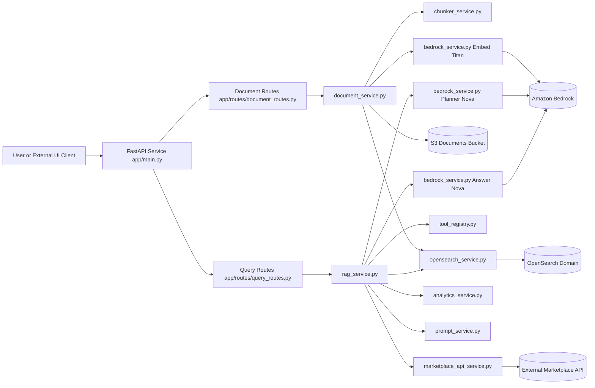
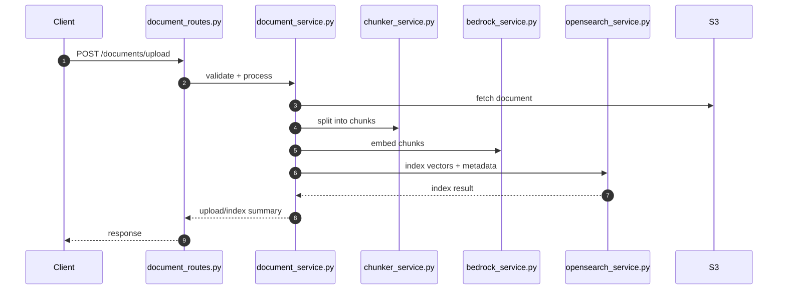
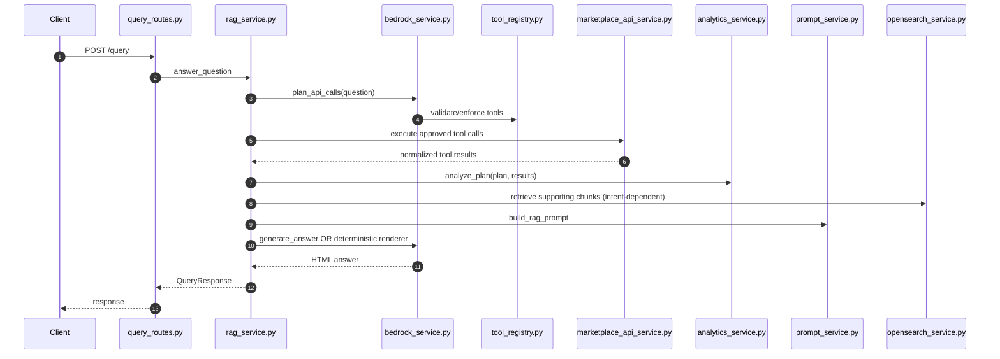

# Green Marketplace - Architecture + HLD

## 1. Purpose and Scope
This document combines Architecture and High-Level Design for the Green Marketplace RAG/Analytics service.

It covers:
- Runtime components in this repository
- External platform dependencies (AWS, Bedrock, OpenSearch, marketplace API)
- Main request/data flows
- Module boundaries and responsibilities
- Deployment/runtime topology

---

## 2. System Context
Green Marketplace provides:
- Document ingestion and indexing for retrieval-augmented responses
- Query answering that combines deterministic marketplace analytics with LLM-generated or deterministic HTML output
- Forecasting/recommendation responses for selected intents

Primary API surfaces:
- `POST /documents/upload`
- `POST /query`
- `GET /health`
- `GET /`

---

## 3. Architecture Overview

---

## 4. Component Inventory (All Major Components)

### 4.1 Application Entry and Config
- `app/main.py`
  - FastAPI app construction
  - Middleware (CORS, Referrer-Policy)
  - Router registration
  - Startup lifecycle (`ensure_index_exists`)
  - Health/root endpoints
- `app/config.py`
  - Environment-backed settings
  - Bedrock model IDs and generation limits
  - OpenSearch endpoint/index/top-k
  - Marketplace API base URL/timeouts/page size
  - App metadata/security headers

### 4.2 API Layer
- `app/routes/document_routes.py`
  - Document upload/indexing endpoint(s)
- `app/routes/query_routes.py`
  - Query orchestration endpoint(s)

### 4.3 Schemas and Contracts
- `app/schemas/document_schema.py`
  - Request/response models for document workflows
- `app/schemas/query_schema.py`
  - Query request/response models
  - API summary structures, tool result shapes, periods, sources

### 4.4 Core Services
- `app/services/rag_service.py`
  - End-to-end query orchestration
  - Planner call, tool execution, analytics binding, response rendering
  - Deterministic renderers by intent and fallback handling
- `app/services/bedrock_service.py`
  - Embeddings generation
  - Planner prompt and planner output normalization/enforcement
  - Final answer generation
- `app/services/analytics_service.py`
  - Deterministic analytics by intent (supply, demand, balance, ratio, prices)
  - Forecasting (demand/price/shortage)
  - Recommendation scoring (seller/buyer)
  - Marketplace summary period analytics
- `app/services/marketplace_api_service.py`
  - Read-only external marketplace API execution
  - Paging/timeout handling and normalized results
- `app/services/tool_registry.py`
  - Allowed tool definitions and payload schemas
  - Planner tool catalog text
- `app/services/opensearch_service.py`
  - OpenSearch index management
  - Document chunk indexing and vector retrieval
- `app/services/document_service.py`
  - Ingestion orchestration: fetch, parse/chunk, embed, index
- `app/services/chunker_service.py`
  - Token-aware chunking with overlap
- `app/services/prompt_service.py`
  - RAG prompt assembly with API context and HTML-answer constraints

### 4.5 Deployment and Operations Assets
- `aws/rag-cloud-formation.yaml`
  - Infra provisioning (VPC/subnet/networking, EC2 runtime, OpenSearch, S3, IAM, monitoring)

### 4.6 External Dependencies (Runtime)
- AWS Bedrock
  - `amazon.titan-embed-text-v2:0` embeddings
  - `amazon.nova-micro-v1:0` planner/answer model
- OpenSearch (vector index + metadata)
- S3 (document source objects)
- External Marketplace API (listings/purchases)

### 4.7 Python Runtime Dependencies
From `requirements.txt`:
- FastAPI + Uvicorn
- Pydantic + pydantic-settings
- python-dotenv
- boto3
- opensearch-py + requests-aws4auth
- requests
- httpx

---

## 5. High-Level Flows

### 5.1 Document Ingestion Flow

### 5.2 Query/RAG + Analytics Flow

---

## 6. HLD: Module Responsibilities and Boundaries

### 6.1 API Boundary
- Routes handle transport concerns only (request parsing/response delivery).
- Business logic lives in services.

### 6.2 Planner/Execution Boundary
- Planner can propose intent/tools but Python enforces:
  - Allowed tool names
  - Argument normalization
  - Required tool combinations for intents
  - Period/source/location constraints

### 6.3 Analytics Boundary
- `analytics_service.py` is deterministic and side-effect free.
- It consumes normalized tool results and emits computed structures used by renderer/LLM.

### 6.4 Rendering Boundary
- `rag_service.py` determines whether to:
  - Use deterministic renderer for known intents
  - Or use LLM answer generation
  - Or fallback response for insufficient/failed generation

### 6.5 Retrieval Boundary
- OpenSearch retrieval is optional for some intents (summary/demand-supply can be API-only paths).

---

## 7. Key Data Contracts
- Planner output: intent, tool calls, periods, groupings, metrics, flags
- Tool result envelope:
  - `tool`
  - `arguments`
  - `execution_status`
  - `record_count`
  - `data.records` (raw)
  - `data.sample_records` (compact)
  - `data.aggregates` (compact deterministic basis)
- Query response envelope:
  - HTML answer
  - answer mode
  - sources
  - API summary (intent, filters, analytics, predictions/recommendations)

---

## 8. Deployment Topology (HLD View)
- Runtime host: EC2 instance running FastAPI/Uvicorn service
- Vector/search store: OpenSearch domain
- Document storage: S3 bucket
- LLM/Embeddings: Bedrock APIs in configured region
- Monitoring: CloudWatch logs/alarms and budget alarms
- Network/security: VPC, subnet, SGs, IAM role/policies from CloudFormation

---

## 9. Security and Governance Controls
- Read-only marketplace tool execution constrained by tool registry
- API argument sanitization/normalization before external calls
- Environment-based configuration and endpoint validation
- Referrer-Policy response header middleware
- IAM-scoped AWS access for EC2 runtime

---

## 10. Design Notes and Trade-offs
- Deterministic analytics + deterministic renderers reduce hallucination risk for marketplace questions.
- Aggregate-driven computation improves resilience when record payloads are partial.
- Planner flexibility is retained, but intent/tool safety is enforced in code.
- HTML response strategy keeps UI rendering predictable across intents.

---

## 11. Future Evolution (Suggested)
- Add explicit versioned API contracts for tool result aggregates.
- Add cached analytics snapshots for repeated period queries.
- Add structured observability for intent/tool/latency per stage.
- Add test suites for all deterministic renderers and period filtering rules.

