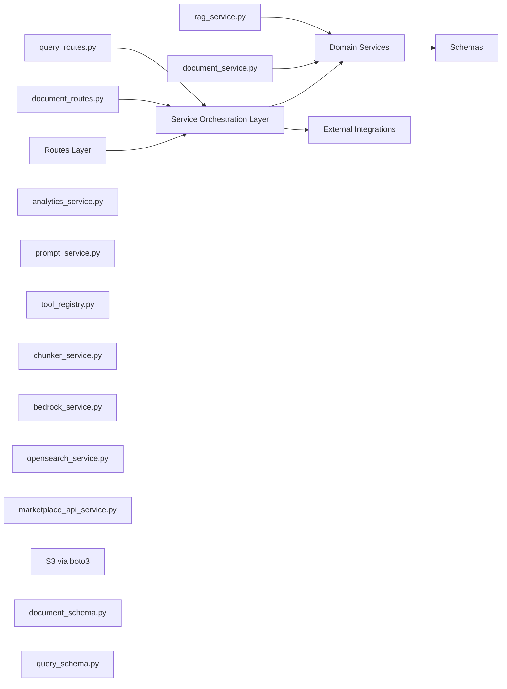
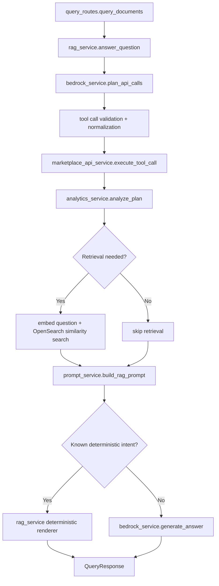
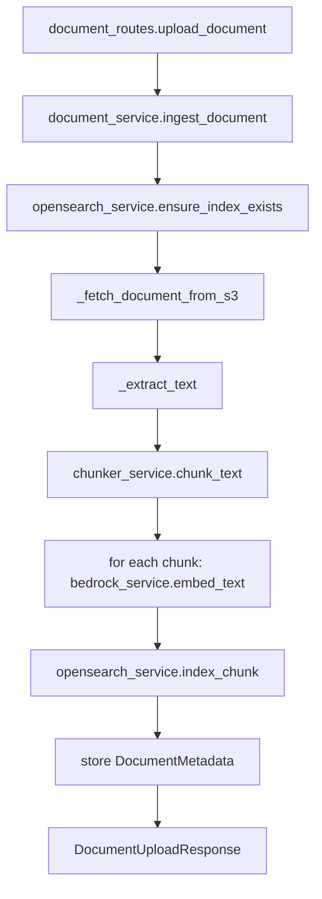

# GreenGrid FastAPI LLD

This Low-Level Design describes only the FastAPI application modules and runtime interactions.

## 1. Application Layers

---

## 2. Module Responsibilities

### 2.1 app/main.py
- Creates FastAPI app.
- Registers CORS and security header middleware.
- Includes routers.
- Runs startup index readiness check.

### 2.2 app/routes/query_routes.py
- Defines POST /query.
- Validates request with QueryRequest.
- Delegates to rag_service.answer_question().
- Converts service exceptions to HTTP errors.

### 2.3 app/routes/document_routes.py
- Defines POST /documents/upload, GET /documents, POST /documents/clear-index, GET /documents/{id}.
- Delegates ingestion and metadata operations to document_service.
- Converts service exceptions to HTTP errors.

### 2.4 app/services/rag_service.py
- Central query orchestrator.
- Runs planning, tool execution, analytics, retrieval, prompt building, rendering/generation.
- Returns QueryResponse.

### 2.5 app/services/document_service.py
- Central insert orchestrator.
- Fetches file from S3, extracts text, chunks text, embeds chunks, indexes chunks.
- Stores and serves in-memory document metadata.

### 2.6 Supporting services
- bedrock_service.py: embedding generation, planner generation, final answer generation.
- opensearch_service.py: index lifecycle, chunk indexing, vector retrieval, index clearing.
- analytics_service.py: deterministic analytics, prediction, recommendation outputs.
- prompt_service.py: grounded prompt assembly with strict output constraints.
- chunker_service.py: token-aware chunking.
- marketplace_api_service.py: read-only marketplace API execution.
- tool_registry.py: allowed tool definitions for planner and execution guardrails.

---

## 3. Key Data Contracts

### 3.1 Query contracts
Request: QueryRequest
- question: string (required)
- top_k: integer 1..20 (optional)

Response: QueryResponse
- answer: HTML string
- source_count: integer
- sources: list of QuerySource
- answer_mode: retrieval_only | retrieval_plus_api | api_only | insufficient_data
- api_facts_used: boolean
- api_summary: QueryApiSummary (optional)

### 3.2 Document insert contracts
Request: DocumentUploadRequest
- document_name
- document_type
- s3_uri

Response: DocumentUploadResponse
- document_id
- document_name
- status
- chunk_count
- message

---

## 4. LLD for Query Answer Generation

Detailed behavior:
1. Planner output decides intent, periods, and tool calls.
2. Tool execution is allowlisted and read-only.
3. Deterministic analytics enriches summary and prediction/recommendation metadata.
4. For known intents, deterministic HTML renderer is preferred.
5. Otherwise, prompt + LLM generation path is used.
6. Response always includes operation metadata in api_summary when available.

Example query walkthrough:
- Input question: Show next month shortage trend for solar and recommend seller action.
- Planner marks prediction/recommendation intent and required tools.
- Tool calls fetch live marketplace data.
- analytics_service computes trend and recommendation scores.
- rag_service selects shortage/recommendation renderer for final HTML answer.
- QueryResponse is returned with answer_mode and api_summary.

---

## 5. LLD for Insert Flow

Insert flow notes:
- Document ID is deterministic from s3_uri hash.
- Chunk ID format: <document_id>_chunk_<index>.
- Partial indexing is supported when some chunks fail.
- Metadata is currently stored in in-memory store.

---

## 6. FastAPI Runtime Boundaries

Inside FastAPI app boundary:
- main.py, routes, schemas, orchestration services, deterministic business logic.

Outside FastAPI app boundary (called integrations):
- Bedrock APIs
- OpenSearch cluster
- S3 object store
- Marketplace external APIs

The application remains API-first with route thinness and service-heavy orchestration.