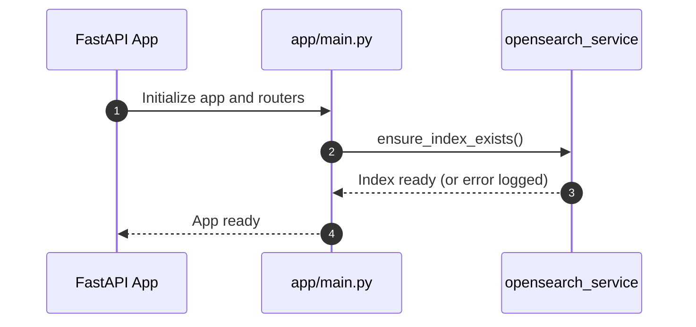
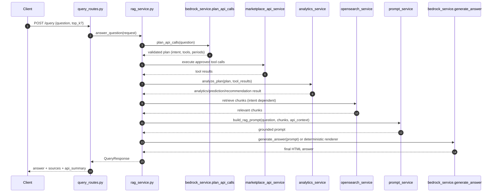
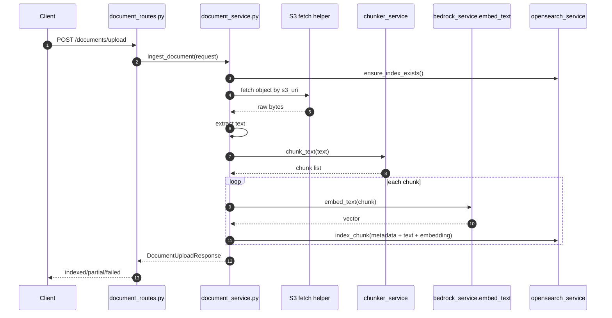

# Green Marketplace FastAPI Workflow

This document covers only the FastAPI application workflow.

## 1. FastAPI Workflow Scope

In scope:
- Application startup workflow
- Query workflow for POST /query
- Insert workflow for POST /documents/upload

Out of scope:
- AWS infrastructure provisioning details
- CloudFormation stack lifecycle

---

## 2. Startup Workflow

When the app starts:
1. FastAPI loads middleware and routers from app/main.py.
2. Lifespan hook runs.
3. OpenSearch index check is triggered by opensearch_service.ensure_index_exists().
4. App starts serving endpoints.



---

## 3. Query Endpoint Workflow (POST /query)

Entry point:
- app/routes/query_routes.py -> query_documents()
- app/services/rag_service.py -> answer_question()

### 3.1 End-to-End Flow



### 3.2 Query Decision Points

Inside answer_question():
1. Plan and execute API calls first.
2. If live data is mandatory and unavailable, return insufficient_data mode.
3. Retrieve OpenSearch chunks for retrieval-required intents.
4. Build prompt from API context + RAG context.
5. Use deterministic renderer for known intents, else call LLM generation.
6. Return QueryResponse with:
- answer
- source_count and sources
- answer_mode
- api_facts_used
- api_summary

### 3.3 Example: How Answer Is Generated for /query

Input example:
```json
{
  "question": "What is current supply by source and what should I price for solar?",
  "top_k": 8
}
```

Generation path:
1. Planner identifies intents and required marketplace tools.
2. Tool executor fetches listing/purchase data.
3. analytics_service computes metrics and recommendation values.
4. rag_service chooses deterministic renderer for pricing guidance if intent matches.
5. If not matched, prompt_service creates grounded prompt and Bedrock LLM returns HTML answer.
6. API response includes answer plus compact operational summary.

---

## 4. Insert Flow (POST /documents/upload)

Entry point:
- app/routes/document_routes.py -> upload_document()
- app/services/document_service.py -> ingest_document()



### 4.1 Insert Flow Output

The insert flow returns:
- document_id
- document_name
- status (indexed | partial | failed)
- chunk_count
- message

---

## 5. Error Mapping in FastAPI Routes

Query route:
- ValueError -> HTTP 400
- RuntimeError -> HTTP 502

Document route:
- FileNotFoundError -> HTTP 404
- ValueError -> HTTP 400
- RuntimeError -> HTTP 502
- Failed ingestion status -> HTTP 422

