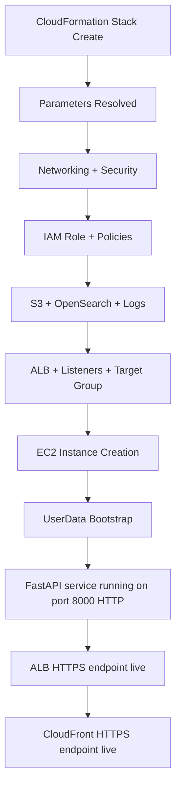
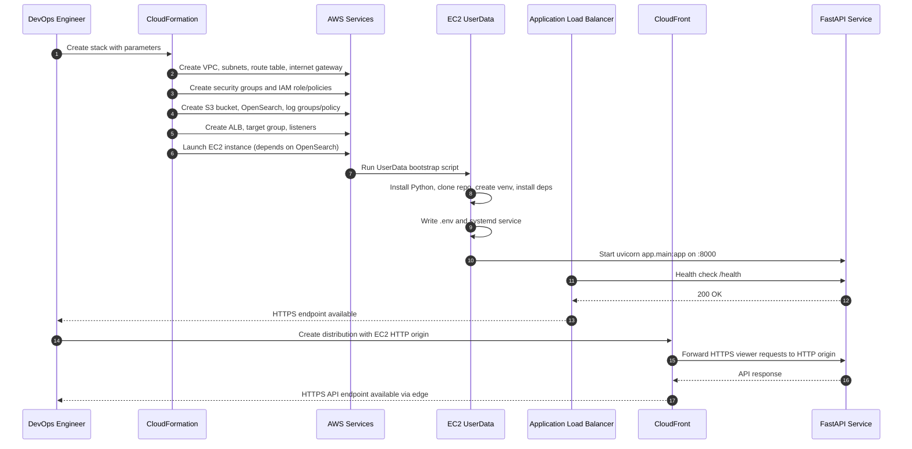

# GreenGrid Exchange Deployment Guide

This file documents only the infrastructure architecture and components created for this application.

## 1. Deployment Scope

This deployment provisions and configures:
- AWS infrastructure (network, security, compute, storage, search, load balancer, logging)
- CloudFront edge delivery layer for HTTPS client access
- EC2 runtime bootstrap (repo clone, Python venv, dependencies, environment file, systemd service)
- Application startup behavior (FastAPI service and OpenSearch index bootstrap)

Primary source of truth:
- aws/rag-cloud-formation.yaml

---

## 2. Deployment Model

All infrastructure is created by one CloudFormation stack.

---

## 3. Component Inventory and Creation Method

### 4.1 Networking Components

| Component | CloudFormation Resource Type | How It Is Created |
|---|---|---|
| VPC | AWS::EC2::VPC | Created directly in stack with CIDR 10.0.0.0/16 |
| PublicSubnet | AWS::EC2::Subnet | Created in first AZ, public IP mapping enabled |
| PublicSubnet2 | AWS::EC2::Subnet | Created in second AZ for ALB multi-subnet requirement |
| InternetGateway | AWS::EC2::InternetGateway | Created and attached to VPC |
| AttachGateway | AWS::EC2::VPCGatewayAttachment | Binds IGW to VPC |
| PublicRouteTable | AWS::EC2::RouteTable | Created and associated with public subnets |
| PublicRoute | AWS::EC2::Route | 0.0.0.0/0 route to internet gateway |
| SubnetRouteTableAssociation | AWS::EC2::SubnetRouteTableAssociation | Associates subnet 1 to route table |
| SubnetRouteTableAssociation2 | AWS::EC2::SubnetRouteTableAssociation | Associates subnet 2 to route table |

### 4.2 Security Components

| Component | CloudFormation Resource Type | How It Is Created |
|---|---|---|
| ALBSecurityGroup | AWS::EC2::SecurityGroup | Inbound 80/443 from internet; outbound all |
| EC2SecurityGroup | AWS::EC2::SecurityGroup | SSH 22 from internet; app 8000 only from ALB SG |
| OpenSearchSecurityGroup | AWS::EC2::SecurityGroup | 443 inbound only from EC2 SG |

### 4.3 Identity and Access Components

| Component | CloudFormation Resource Type | How It Is Created |
|---|---|---|
| GreenGridEC2Role | AWS::IAM::Role | EC2-trusted role with least-privilege permissions |
| GreenGridEC2RoleInstanceProfile | AWS::IAM::InstanceProfile | Attaches IAM role to EC2 instance |
| S3BucketPolicy | AWS::IAM::Policy | Grants s3:GetObject and s3:ListBucket |
| BedrockPolicy | AWS::IAM::Policy | Grants bedrock:InvokeModel for approved models |
| OpenSearchPolicy | AWS::IAM::Policy | Grants es:ESHttp* methods to target domain |
| CloudWatchLogsPolicy | AWS::IAM::Policy | Grants logs create/write capabilities |
| OpenSearchServiceLinkedRole | AWS::IAM::ServiceLinkedRole | Required service-linked role for OpenSearch |

### 4.4 Storage and Search Components

| Component | CloudFormation Resource Type | How It Is Created |
|---|---|---|
| DocumentBucket | AWS::S3::Bucket | Versioning + AES256 encryption + public access block |
| OpenSearchDomain | AWS::OpenSearchService::Domain | VPC-bound domain with TLS, encryption, and EBS |

### 4.5 Load Balancing and Traffic Components

| Component | CloudFormation Resource Type | How It Is Created |
|---|---|---|
| ApplicationLoadBalancer | AWS::ElasticLoadBalancingV2::LoadBalancer | Internet-facing ALB across two public subnets |
| ApiTargetGroup | AWS::ElasticLoadBalancingV2::TargetGroup | Routes HTTP 8000 to EC2 instance, /health check |
| HTTPListener | AWS::ElasticLoadBalancingV2::Listener | Redirects port 80 traffic to HTTPS 443 |
| HTTPSListener | AWS::ElasticLoadBalancingV2::Listener | Terminates TLS via ACM cert and forwards to target group |

### 4.6 Monitoring and Logging Components

| Component | CloudFormation Resource Type | How It Is Created |
|---|---|---|
| OpenSearchLogGroup | AWS::Logs::LogGroup | Application logs group with retention |
| OpenSearchIndexSlowLogsGroup | AWS::Logs::LogGroup | Index slow logs group with retention |
| OpenSearchLogGroupPolicy | AWS::Logs::ResourcePolicy | Allows OpenSearch service to write logs |

### 4.7 Compute and Runtime Host Component

| Component | CloudFormation Resource Type | How It Is Created |
|---|---|---|
| EC2Instance | AWS::EC2::Instance | Created after OpenSearch domain is ready; bootstrapped via UserData |

### 4.8 Edge Delivery Component

| Component | Creation Method | How It Is Created |
|---|---|---|
| CloudFront Distribution | Manual (outside current CloudFormation template) | Created in AWS CloudFront with HTTPS viewer access and HTTP origin forwarding to EC2 API |

---

## 4. Components Created by EC2 UserData Bootstrap

These are not separate CloudFormation resources. They are created by the EC2 startup script in UserData.

| Component | Created By | Purpose |
|---|---|---|
| /opt/greengrid directory | mkdir -p | App working directory |
| Application source code | git clone ${GitHubRepository} . | Pull repository code to EC2 |
| Python 3.8 runtime packages | yum/amazon-linux-extras | Runtime for FastAPI service |
| Virtual environment | python3.8 -m venv venv | Isolated dependency environment |
| Python dependencies | pip install -r requirements.txt | Installs app dependencies |
| .env file | heredoc in UserData | Injects runtime config values |
| systemd unit file | /etc/systemd/system/greengrid-api.service | Process management |
| Running API service | systemctl enable/start greengrid-api.service | Starts uvicorn app.main:app |

---

## 5. Runtime Components and How They Start

After EC2 bootstrap:
- Uvicorn serves the FastAPI app on 0.0.0.0:8000.
- ALB forwards HTTPS requests to EC2 target group on port 8000.
- CloudFront receives client HTTPS requests and forwards API requests to EC2 HTTP origin (as configured).
- /health is used by ALB target health checks.
- Document ingestion uses S3 + Bedrock + OpenSearch through IAM role permissions.
- On startup, the app lifecycle ensures required OpenSearch index availability.

Client request path used now:
- Client HTTPS -> CloudFront
- CloudFront -> EC2 HTTP API origin
- FastAPI on EC2 responds with API output

---

## 6. Deployment Creation Sequence

---

